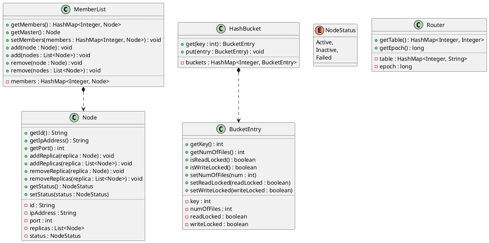

# DHT Design

## Cassandra

### Data structure

* **Member List** maintains a list of physical nodes
* **Router** maps hash slots to the hash value of physical nodes.
* **Replicas** Successors. Number of replicas is defined from config file.
* **Hash Buckets** A map of hash value and number of files with RW lock. Used for mimicking file transfer. 



### Client

1. Start node

    Start data node with status. If no status specified, active is used as default value.

    ```bash

    dht-cli start-node [--status=active | inactive] 

    ```

2. Stop node
    
    ```bash

    dht-cli stop-node

    ```
   
3. Routing table

    * Cache routing table locally. 

4. Read/Write requests

    * Send a read request for a key or a range of keys

        ```bash

        dht-cli --request --read=<key> 

        ```

    * Send a write request for a key or a range of keys

        ```bash

        dht-cli --request --write=<key> 

        ```

    * Invoke request generator to generate different R/W load
        
        ```bash

        dht-cli --request --request-generator 

        ```

### Control Client

1. Memberships

    * Node addition

        CC requests an inactive node (VM) to mark itself as active

        ```bash

        dht-cc --members-add --node=<IP address>

        ```

    * Node removal 

        CC requests the failed node (VM) to mark itself as inactive, and signals the neighbor to start the update

        ```bash

        dht-cc --members-remove --node=<IP address>

        ```

2. Load balancing

    CC requests a data node to change its range

    ```bash

    dht-cc <--load-increase | --load-decrease> --node=<IP address>

    ```

3. System Info

    CC requests to print out system info

    ```bash

    dht-cc --system-info

    ```
4. Turn on/off logs

    ```bash

    dht-cc --log --activate=<true | false>

    ```

### Data node

1. Cache routing table
2. Node activate
    * Activate node
    * Start table update
3. Load balancing
    * Change its range in local table
    * Start table update
4. Read/write request. Send read/write request to (N + 1) / 2 replicas 
    * If a node failed, try to reach coordinator with a request to create new replica
    * If coordinator failed, try the direct successor of the coordinator with a request to create new replica.
5. Table updates
    * Handle update request sent from neighbor
    * Gossip update to other neighbors
6. File transfer
    * RW-lock on each hash bucket
    * If read/write a locked bucket, returns error message

### Configuration

* Size of hash slots
* Number of replicas
* Data nodes
* Internal port. Port for internal communication between nodes
* External port. Port for client access
* Timeout

### Logs

1. Data node
    * Node activate/deactivate
    * Read/write request
    * Table updates
    * File transfer