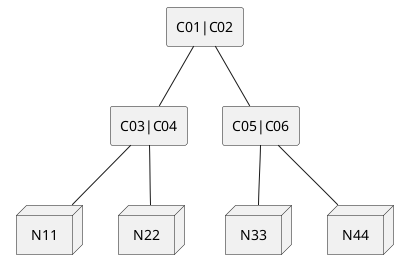

# DHT

## Data Structure

### Ring based - Swift and Cassandra

* Physical Node
    * id
    * ip address
    * port
    * status
    * virtual nodes - set of virtual nodes

    | Id | IP Address | Port | Status | Virtual Nodes |
    |-|-|-|-|
    | 1 | 192.168.0.10 | 9090 | active | {15, 63} |
    | 2 | 192.168.0.11 | 9090 | active | {31} |
    | 3 | 192.168.0.12 | 9090 | inactive | {47} |

* Virtual Node
    * hash
    * physical node id

    | Hash | Physical Node Id |
    |-|-|
    | 15 | 1 |
    | 31 | 2 | 
    | 47 | 3 | 
    | 63 | 1 | 

* Routing table
    * epoch
    * virtual nodes

### Elastic DHT

* Physical Node
    * id
    * ip address
    * port
    * status

    | Id | IP Address | Port | Status |
    |-|-|-|-|
    | 11 | 192.168.0.10 | 9090 | active |
    | 22 | 192.168.0.11 | 9090 | active |
    | 33 | 192.168.0.12 | 9090 | inactive |

* Node
    * bucket
    * replicas

    | Bucket | Node Id |
    |-|-|
    | 0 | 22, 35, 86 |
    | 1 | 55, 33, 56 |
    | 2 | 22, 44, 63 |
    |..||
    | 160 | 22, 33, 4 |

* Routing table
    * epoch
    * nodes
  

### Ceph

* Physical Node
    * id
    * ip address
    * port
    * status

    | Id | IP Address | Port | Status |
    |-|-|-|-|
    | N11 | 192.168.0.10 | 9090 | active |
    | N22 | 192.168.0.11 | 9090 | active |
    | N33 | 192.168.0.12 | 9090 | inactive |
    | N44 | 192.168.0.12 | 9091 | active |

* Cluster
    * id
    * weight
    * sub-clusters
    * status

    | Id | Weight | Sub-clusters | Status|
    |-|-|-|-|
    | C00 | 3.8 | {C01, C02} | active |
    | C01 | 2.0 | {C03, C04} | active |
    | C02 | 1.8 | {C5, C06} | active |
    | C03 | 0.9 | {N11} | active |
    | C04 | 1.1 | {N22} | active |
    | C05 | 1.0 | {N33} | active |
    | C06 | 0.8 | {N44} | active |
    |...|...|...|...|

* Map
    * epoch
    * root - root cluster

* Placement group
    * hash
    * id

    | Bucket | Group Id |
    |-|-|
    | 0 | PG01 |
    | 1 | PG02 |
    | 2 | PG03 |
    |..||
    | 160 | PG160 |

## APIs

### Proxy (for centralized cases)

1. Get table
   
    * Input: 
        * none
    * Output: 
        * table   

2. Update table
   
    * Input: 
        * none
    * Output: 
        * updated table.

3. Load balancing

    **For elastic DHT:**
    * Input:
        * bucket - bucket needs to be moved
        * node id - node that bucket is moved to
    * Output:
        * updated table 
  
    **For Ceph:**
    * Request is directly sent to data node. Data node informs proxy to propagate the changes.

    **For others:**
    * Input:
        * type - increase or decrease
        * node id - required if type = decrease. the id of the node needs to be removed
    * Output:
        * updated table 

4. Node failure
   
    * Input:
        * node id - the id of the failed node
    * Output:
        * updated table 

5. Expand table (Elastic DHT only)
    
    * Input:
        * number of additional slots
    * Output:
        * updated table

6. Shrink table (Elastic DHT only)
    
    * Input:
        * number of shrink slots
    * Output:
        * updated table
        * message if failed

### Data node

1. Read

    * Input:
        * epoch
        * filename
    * Output:
        * message [file found | not found | no response]

2. Write

    * Input:
        * epoch
        * filename
    * Output:
        * message [success | failed | no response ]

3. Update table
    Handle update request sent from server

    * Input:
        * table - updated table
    * Output:
        * message [success | failed | no response ]

5. System info
   
    * Input: 
        * none
    * Output:
        * properties of node in string format

6. Log

    * Input:
        * on/off
    * Output:
        * none

7. Load balancing (For Ceph and Distributed cases)
   
    **For Ceph**
    * Input:
        * weight - new weight
    * Output:
        * updated map

    **For Cassandra**
    Increase/decrease the range by changing the id of this node
    * Input:
        * type - increase or decrease

    **For Elastic DHT**
    * Input:
        * bucket - bucket needs to be moved
        * node id - node that bucket is moved to
    * Output:
        * updated table

8. Expand table (Distributed Elastic DHT only)
    
    * Input:
        * number of additional slots
    * Output:
        * updated table

9.  Shrink table (Distributed Elastic DHT only)
    
    * Input:
        * number of shrink slots
    * Output:
        * updated table
        * message if failed 

### Configuration

* Number of hash slots
* Number of replicas
* Proxy (if centralized case)
* Data nodes
* Port
* Request timeout

Additional properties for Ceph
* Number of children in a cluster
* Enable placement group
* Node initial weight
