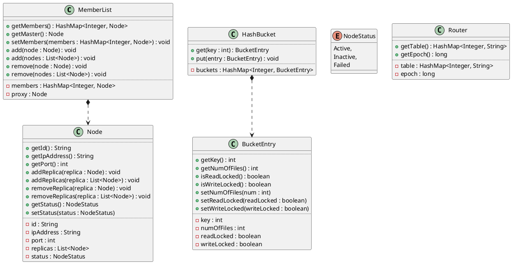

# DHT Design

## Elastic DHT - Centralized

### Data structure

* **Member List** maintains a list of physical nodes. 
* **Router** maps hash slots to the hash value of physical node. 
* **Replicas** List of replicas.
* **Hash Buckets** A map of hash value and number of files with RW lock. Used for mimicking file transfer. 



### Client

1. Start node

    Start data node with status. If no status specified, active is used as default value.

    ```bash

    dht-cli start-node [--status=active | inactive] 

    ```

2. Stop node
    
    ```bash

    dht-cli stop-node

    ```
   
3. Routing table

    * Cache routing table locally. 
    * If a piggybacked epoch number is different than the cached one, send a request to proxy to get the latest table.

4. Read/Write requests

    * Send a read request for a key or a range of keys

        ```bash

        dht-cli --request --read=<key> 

        ```

    * Send a write request for a key or a range of keys

        ```bash

        dht-cli --request --write=<key> 

        ```

    * Invoke request generator to generate different R/W load
        
        ```bash

        dht-cli --request --request-generator 

        ```
5. Request timeout
   
    * Return node failure message

### Control Client

1. Memberships

    * Node addition

        CC requests an inactive node (VM) to mark itself as active

        ```bash

        dht-cc --members-add --node=<IP address>

        ```

    * Node removal 

        CC requests the failed node (VM) to mark itself as inactive


        ```bash

        dht-cc --members-remove --node=<IP address>

        ```

    * Membership updates

        CC signals the proxy to start the update

        ```bash

        dht-cc --members-update

        ```

2. Load balancing

    CC requests proxy to move a hash bucket from one data node to another

    ```bash

    dht-cc --load-balance --from=<IP address> --to=<IP address>

    ```

3. Node Failure
   
    CC specifies where the new replicas should be

    ```bash

    dht-cc --members-replace --node=<IP address> --with=<IP address>

    ```
   
4. System Info

    CC requests to print out system info

    ```bash

    dht-cc --system-info

    ```
5. Turn on/off logs

    ```bash

    dht-cc --log --activate=<true | false>

    ```

### Proxy/Central server

1. Membership Update

    * Receive CC signals, start membership update
    * Updates table, and sends the updates to all nodes.

2. Load balancing

    * Receive CC signals, create/remove a virtual node of a given data node
    * Informs involved data nodes to perform data transfer
    * Updates table, and sends the updates to all nodes.

3. Node failure
    
    * Receive CC signals
    * Replace the failed node with new replica
    * Updates table, and sends the updates to all nodes.

### Data node

1. Cache routing table
2. Read/write request
3. Table updates
    * Handle update request sent from server
4. File transfer
    * RW-lock on each hash bucket
    * If read/write a locked bucket, returns error message


### Configuration

* Size of hash slots
* Number of replicas
* Proxy
* Data nodes
* Internal port. Port for internal communication between nodes
* External port. Port for client access
* Timeout

### Logs

1. Proxy
    * Proxy start/stop
    * Membership updates
    * Load balancing
    * Node failure

2. Data node
    * Node activate/deactivate
    * Read/write request
    * Table updates
    * File transfer